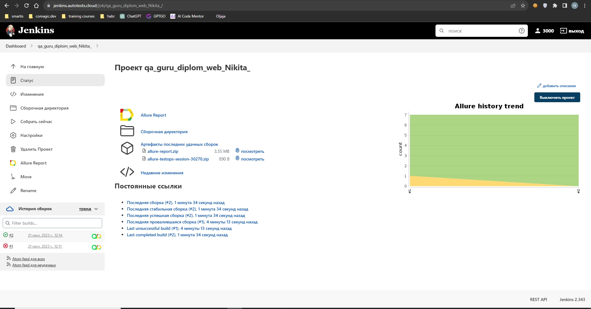
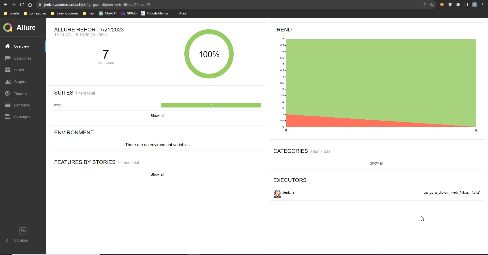
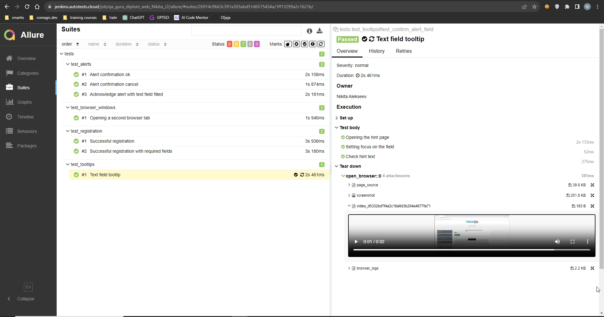
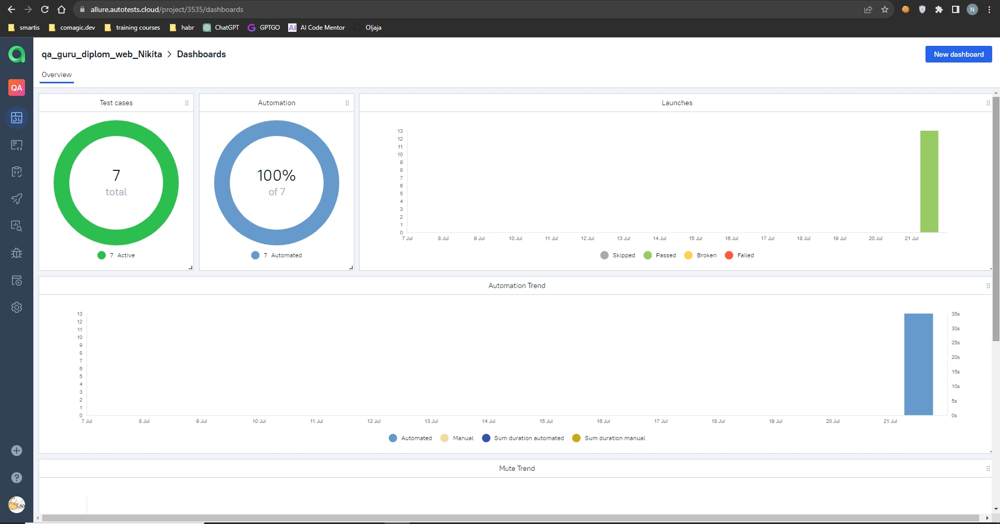
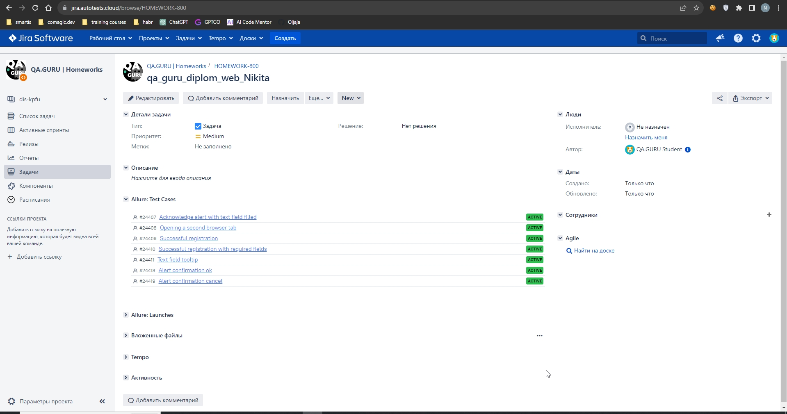

## Autotest UI project for demoqa.com
### Technologies used

<code></code>
<code></code>
<code></code>
<code></code>
<code></code>
<code></code>
<code></code>
<code></code>
<code></code>
<code></code>

  

### What tests check
* Alert confirmation
* Alert confirmation with text field filling
* Opening a second tab in the browser
* Successful registration
* Successful registration with required fields
* Hint for text box
 

###  [Running a project in Jenkins](https://jenkins.autotests.cloud/job/qa_guru_diplom_web_Nikita_/)
##### Implemented parameterized assembly, to run the project you need to select a browser and its version.

###  [Allure report](https://jenkins.autotests.cloud/job/qa_guru_diplom_web_Nikita_/2/allure//)
##### After passing the tests, the results can be viewed in the Allure report.
  

##### In the Behaviors tab there are collected test cases, which describe the steps. UI tests have attachments: screenshot, test video, log and page_source.

##### Test video Hint for text field.

https://selenoid.autotests.cloud/video/6d814ab4999a32e472e0ff577c178931.mp4

###  [Integration with Allure TestOps](https://allure.autotests.cloud/project/3535/dashboards)

##### Also, all reporting is saved in Allure TestOps, where similar graphs are built.

#### In the suites tab, we can:
- Manage all test cases or each separately
- Rerun each test separately from all tests
- Set up integration with Jira
- Add manual tests, etc.

   

###  [Jira Integration](https://jira.autotests.cloud/browse/HOMEWORK-800)
##### Having set up integration with Jira through Allure TestOps, you can forward the result of passing tests and a list of test cases from Allure to a ticket

